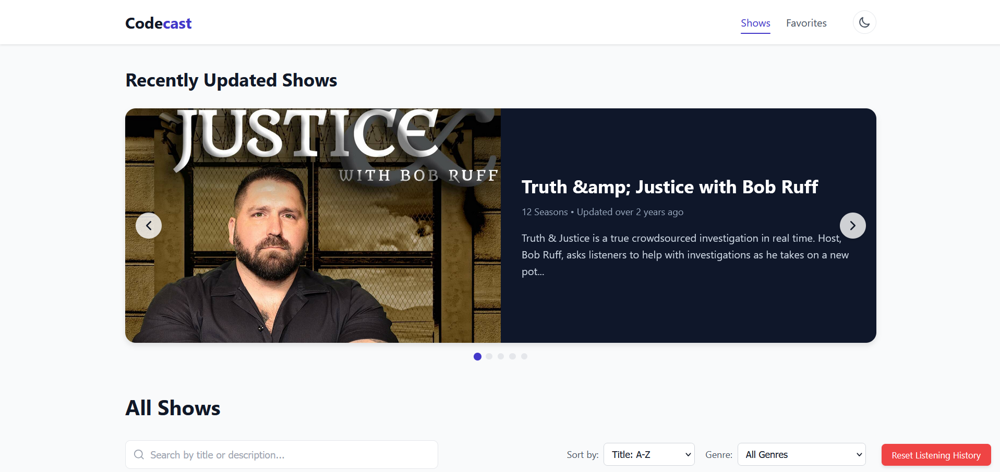

# CodeCast: Modern Podcast Web Application

<div align="center">

[](https://www.typescriptlang.org/)
[](https://reactjs.org/)
[](https://github.com/pmndrs/zustand)
[](https://opensource.org/licenses/MIT)

[Live Application](https://codecastpod.netlify.app/)

</div>

## 📋 Overview

CodeCast is a feature-rich podcast platform built with modern web technologies, offering an intuitive and responsive experience for podcast enthusiasts. The application allows users to browse, discover, and listen to a diverse catalog of podcasts with a polished user interface and seamless audio playback.

 

## 🚀 Quick Start

### Live Application

The production version of CodeCast is deployed at: [https://codecastpod.netlify.app/](https://codecastpod.netlify.app/)

### Development Setup

```bash
# Clone the repository
git clone https://github.com/MorenaDlamini/MORDLA616_PTO2405_ChadBosch-MORENADLAMINI_DJS11.git
cd codecast

# Install dependencies
npm install

# Start development server
npm run dev

# Build for production
npm run build

# Preview production build
npm run preview
```

## ✨ Key Features

### 🎧 Advanced Audio Player
- **Fluid Playback Controls**: Seamless play/pause, skip forward/backward (15s), and track navigation
- **Playback Rate Control**: Adjustable speeds from 0.5x to 2.0x for flexible listening
- **Volume Management**: Precise volume control with mute toggle
- **Keyboard Shortcuts**:
  - `Space`: Toggle play/pause
  - `Left/Right arrows`: Skip backward/forward
  - `M`: Toggle mute
  - `N/P`: Next/previous episode
- **Progress Persistence**: Automatically saves and resumes playback position across sessions
- **Sleep Timer**: Set duration-based auto-stop for nighttime listening
- **Background Playback**: Continues playing when navigating between pages

### 📚 Content Discovery & Management
- **Responsive Show Browser**: Grid layout with adaptive sizing for all devices
- **Multi-faceted Search**:
  - Real-time fuzzy text search with tolerance for typos
  - Levenshtein distance algorithm for matching similar terms
  - Weighted title vs. description matching
- **Genre Filtering**: Browse shows by category with one-click filtering
- **Sort Options**: Arrange shows by recently updated, alphabetical, or trending
- **Visual Indicators**: Clear markers for in-progress, completed, and new episodes

### 🌙 User Experience
- **Dynamic Theming**: Automatic light/dark mode based on system preference with manual override
- **Persistent Favorites**: Save and organize favorite episodes across sessions
- **Responsive Design**: Optimized layouts for mobile, tablet, and desktop viewports
- **Carousel Navigation**: Featured and recently updated content in an interactive slider
- **Progress Tracking**: Visual indicators for partial and complete listens
- **Queue Management**: Add, remove, and reorder upcoming episodes

### 🛠️ Technical Implementation
- **Offline Capability**: Core functionality available without internet connection
- **Performance Optimization**: Lazy-loaded components and efficient state management
- **Accessibility Compliance**: WCAG 2.1 AA standards for inclusive design
- **Cross-Browser Support**: Tested on Chrome, Firefox, Safari, and Edge

## 🏗️ Architecture

### System Design

CodeCast follows a component-based architecture with unidirectional data flow:

```
┌─────────────────┐      ┌─────────────────┐      ┌─────────────────┐
│                 │      │                 │      │                 │
│  UI Components  │◄────►│  State Stores   │◄────►│    Services     │
│                 │      │                 │      │                 │
└─────────────────┘      └─────────────────┘      └─────────────────┘
        ▲                                                 ▲
        │                                                 │
        │                                                 │
        ▼                                                 ▼
┌─────────────────┐                              ┌─────────────────┐
│                 │                              │                 │
│     Hooks       │                              │  Local Storage  │
│                 │                              │                 │
└─────────────────┘                              └─────────────────┘
```

### Component Interaction Diagram

```
┌───────────────┐     ┌─────────────┐     ┌───────────────┐
│  AudioPlayer  │────►│ playerStore │◄────│ audioService  │
└───────┬───────┘     └──────┬──────┘     └───────────────┘
        │                    │                    ▲
        ▼                    ▼                    │
┌───────────────┐     ┌─────────────┐             │
│ PlaylistQueue │◄────┤ EpisodeList │─────────────┘
└───────────────┘     └─────────────┘
```

### State Management

CodeCast uses Zustand for state management with isolated stores:

- **playerStore**: Controls audio playback state and queue management
  - Current episode tracking
  - Playlist management
  - Playback preferences (volume, rate)
  - Progress tracking
  
- **showsStore**: Manages podcast catalog data
  - Show and episode metadata
  - Genre categorization
  - Search and filtering logic
  
- **favoritesStore**: Handles user preferences
  - Favorite episodes storage
  - Listen history
  - Sort preferences
  
- **themeStore**: Controls appearance settings
  - Light/dark mode preference
  - UI customization options

## 📁 Project Structure

```
src/
├── App.css                        # Root component styles
├── App.tsx                        # Root component with routing
├── index.css                      # Global styles
├── main.tsx                       # Application entry point
├── vite-env.d.ts                  # Vite type declarations
├── assets/                        # Static assets
│   ├── favicon.ico                # Browser favicon
│   └── react.svg                  # React logo
├── components/                    # UI components
│   ├── AudioPlayer/               # Audio playback components
│   │   ├── AudioPlayer.css        # Player styling
│   │   ├── AudioPlayer.tsx        # Main player component
│   │   ├── PlaylistQueue.css      # Queue styling
│   │   └── PlaylistQueue.tsx      # Queue management
│   │
│   ├── EpisodeList/               # Episode listing components
│   │   ├── EpisodeList.css        # Episode list styling
│   │   └── EpisodeList.tsx        # Episode list component
│   │
│   ├── FavoritesList/             # Favorites management
│   │   ├── FavoritesList.css      # Favorites styling
│   │   └── FavoritesList.tsx      # Favorites component
│   │
│   ├── Filters/                   # Content filtering
│   │   ├── Filters.css            # Filter styling
│   │   └── Filters.tsx            # Filter component
│   │
│   ├── SearchFilter/              # Search functionality
│   │   ├── SearchFilter.css       # Search styling
│   │   └── SearchFilter.tsx       # Search component
│   │
│   ├── SeasonList/                # Season browsing
│   │   ├── SeasonList.css         # Season list styling
│   │   └── SeasonList.tsx         # Season list component
│   │
│   ├── ShowCard/                  # Show display card
│   │   ├── ShowCard.css           # Card styling
│   │   └── ShowCard.tsx           # Card component
│   │
│   ├── ShowCarousel/              # Featured content slider
│   │   ├── ShowCarousel.css       # Carousel styling
│   │   └── ShowCarousel.tsx       # Carousel component
│   │
│   ├── ThemeToggle/               # Theme switching
│   │   └── ThemeToggle.tsx        # Theme toggle component
│   │
│   └── ui/                        # Common UI elements
│       └── Loading/               # Loading indicators
│           ├── Loading.css        # Loading styling
│           └── Loading.tsx        # Loading component
├── hooks/                         # Custom React hooks
│   └── useAudioService.ts         # Hook for audio player integration
├── layouts/                       # Page layouts
│   ├── MainLayout.css             # Layout styling
│   └── MainLayout.tsx             # Main application layout
├── pages/                         # Route-level components
│   ├── Favorites.tsx              # Favorites page
│   ├── Home.tsx                   # Landing page
│   ├── NotFound.tsx               # 404 page
│   ├── Pages.css                  # Shared page styling
│   ├── Season.tsx                 # Season details page
│   └── Show.tsx                   # Show details page
├── services/                      # Business logic
│   ├── api.ts                     # Data fetching
│   ├── audioService.ts            # Audio playback engine
│   └── storage.ts                 # Local data persistence
├── store/                         # Zustand state stores
│   ├── favoritesStore.ts          # User favorites management
│   ├── playerStore.ts             # Audio playback state
│   ├── showsStore.ts              # Content catalog
│   └── themeStore.ts              # UI theme state
├── types/                         # TypeScript definitions
│   └── index.ts                   # Type declarations
└── utils/                         # Utility functions
    ├── dateUtils.ts               # Date formatting utilities
    └── searchUtils.ts             # Search algorithms
```

## 🔧 Technical Details

### Audio Engine Implementation

The audio system is built on the HTML5 Audio API with several enhancements:

```typescript
// Simplified example of the audio service core
const audioService = {
  // Access to the native HTML5 Audio element
  getAudioElement: () => audioElement,
  
  // Loads audio source with position memory
  loadEpisode: (audioUrl, startTime = 0, autoplay = false) => {
    audioElement.src = audioUrl;
    audioElement.currentTime = startTime;
    if (autoplay) audioElement.play();
    return true;
  },
  
  // Playback controls with error handling
  play: () => audioElement.play().catch(handlePlaybackError),
  pause: () => audioElement.pause(),
  
  // Advanced control methods
  seek: (time) => { audioElement.currentTime = time; },
  setVolume: (volume) => { audioElement.volume = volume; },
  setPlaybackRate: (rate) => { audioElement.playbackRate = rate; }
};
```

Key audio engine features:

- **Global Audio Instance**: Single audio element managed through a service
- **Event-Based Updates**: DOM events drive UI state changes
- **Error Recovery**: Graceful handling of playback failures
- **Position Memory**: Auto-saves current position every 10 seconds
- **Format Support**: Compatible with MP3, AAC, and WAV formats

### State Management with Zustand

Example of player state implementation:

```typescript
// Simplified playerStore implementation
export const usePlayerStore = create<PlayerState>((set, get) => ({
  // Playback state
  isPlaying: false,
  currentEpisode: null,
  currentTime: 0,
  duration: 0,
  volume: 0.8,
  playbackRate: 1.0,
  
  // Queue management
  playlist: [],
  currentEpisodeIndex: null,
  
  // Core actions
  togglePlayPause: () => set(state => ({ isPlaying: !state.isPlaying })),
  
  skipToNext: () => {
    const state = get();
    if (!state.playlist.length || state.currentEpisodeIndex === null) return;
    
    const nextIndex = state.currentEpisodeIndex + 1;
    if (nextIndex >= state.playlist.length) return;
    
    const nextItem = state.playlist[nextIndex];
    set({
      currentEpisode: nextItem,
      currentEpisodeIndex: nextIndex,
      currentTime: 0,
      isPlaying: true
    });
  },
  
  // Progress tracking
  markAsCompleted: () => {
    const state = get();
    if (!state.currentEpisode) return;
    
    const { showId, seasonNumber, episode } = state.currentEpisode;
    const key = `${showId}_s${seasonNumber}_e${episode.episode}`;
    
    const updatedCompleted = { ...state.completedEpisodes, [key]: true };
    set({ completedEpisodes: updatedCompleted });
    localStorage.setItem('codecast_completed_episodes', JSON.stringify(updatedCompleted));
  }
}));
```

### Search and Filter Implementation

CodeCast implements an efficient fuzzy search algorithm:

```typescript
// Simplified search implementation
const searchShows = (shows, query) => {
  if (!query) return shows;
  
  const lowerQuery = query.toLowerCase();
  
  return shows.filter(show => {
    // Title match (weighted higher)
    const titleScore = fuzzyMatch(show.title.toLowerCase(), lowerQuery);
    
    // Description match (weighted lower)
    const descScore = fuzzyMatch(show.description.toLowerCase(), lowerQuery) * 0.5;
    
    // Combined relevance score
    const score = Math.max(titleScore, descScore);
    
    // Consider it a match if score exceeds threshold
    return score > 0.6;
  }).sort((a, b) => {
    // Sort by relevance score
    const aScore = fuzzyMatch(a.title.toLowerCase(), lowerQuery);
    const bScore = fuzzyMatch(b.title.toLowerCase(), lowerQuery);
    return bScore - aScore;
  });
};

// Levenshtein distance for fuzzy matching
const fuzzyMatch = (text, query) => {
  // Implementation of fuzzy matching algorithm
  // Returns a score between 0 and 1
};
```

### Client-side Caching Strategy

The application implements progressive caching:

1. **Short-term memory**: Session storage for current play session
2. **Long-term preferences**: Local storage for favorites and settings
3. **Content caching**: Temporary storage of show metadata for offline use

```typescript
// Example of the caching approach
const cachedFetch = async (url) => {
  const cacheKey = `codecast_cache_${url}`;
  
  // Check cache first
  const cachedData = localStorage.getItem(cacheKey);
  if (cachedData) {
    const { data, timestamp } = JSON.parse(cachedData);
    
    // Use cache if it's less than 1 hour old
    if (Date.now() - timestamp < 3600000) {
      return data;
    }
  }
  
  // Fetch fresh data
  const response = await fetch(url);
  const freshData = await response.json();
  
  // Update cache
  localStorage.setItem(cacheKey, JSON.stringify({
    data: freshData,
    timestamp: Date.now()
  }));
  
  return freshData;
};
```

## 📱 Responsive Design

CodeCast implements a mobile-first responsive design with these breakpoints:

| Breakpoint | Target Devices | Layout Adjustments |
|------------|----------------|-------------------|
| < 576px    | Mobile phones  | Single column, condensed controls |
| 576-768px  | Large phones, small tablets | Two column grid, expanded controls |
| 768-992px  | Tablets, small laptops | Three column grid, full player |
| > 992px    | Desktops, large displays | Four column grid, extended features |

Key responsive features:

- **Fluid Typography**: Scales with viewport width using CSS clamp()
- **Responsive Grid**: CSS Grid with auto-fit and minmax for dynamic column counts
- **Conditional Rendering**: Components adapt to available space
- **Touch Optimization**: Larger hit targets on touch devices

## 🛠️ Development Tools

### Scripts

```json
{
  "scripts": {
    "dev": "vite",
    "build": "tsc && vite build",
    "lint": "eslint . --ext ts,tsx --report-unused-disable-directives --max-warnings 0",
    "preview": "vite preview",
    "test": "vitest run",
    "test:watch": "vitest",
    "test:coverage": "vitest run --coverage",
    "storybook": "storybook dev -p 6006",
    "build-storybook": "storybook build"
  }
}
```

### Development Environment

- **IDE**: VS Code with recommended extensions
  - ESLint
  - Prettier
  - TypeScript Error Translator
  - React Developer Tools

- **Browser Extensions**:
  - React Developer Tools
  - Redux DevTools (works with Zustand)

## 🧪 Testing Strategy

CodeCast implements multiple testing layers:

- **Unit Tests**: Individual utility and hook testing
- **Component Tests**: UI component isolation testing
- **Integration Tests**: Component interaction verification
- **End-to-End Tests**: Full user flow validation

Key testing tools:
- Vitest for unit and component tests
- React Testing Library for component interaction
- MSW for API mocking
- Playwright for end-to-end testing

## 🔍 Best Practices

### Code Patterns

- **Custom Hooks**: Logic extraction for reusability
- **Compound Components**: Composable UI elements
- **Render Props**: Flexible component rendering
- **Memoization**: Performance optimization with React.memo and useMemo

### Performance Optimization

- **Code Splitting**: React.lazy for on-demand loading
- **Tree Shaking**: Elimination of unused code
- **Image Optimization**: Proper sizing and WebP format
- **Render Optimization**: Preventing unnecessary renders

### Accessibility Features

- **Keyboard Navigation**: Complete functionality without mouse
- **Screen Reader Support**: ARIA attributes and semantic HTML
- **Focus Management**: Proper focus trapping in modals
- **Color Contrast**: WCAG AA compliant color scheme

## 🤝 Contributing

We welcome contributions to CodeCast! Please follow these steps:

1. **Fork the Repository**: Create your own copy to work on
2. **Create a Branch**: `git checkout -b feature/amazing-feature`
3. **Make Changes**: Implement your feature or fix
4. **Lint and Test**: Ensure code quality with `npm run lint && npm run test`
5. **Commit Changes**: Use conventional commits format
6. **Push to Branch**: `git push origin feature/amazing-feature`
7. **Open Pull Request**: Submit your changes for review

## 🐛 Known Issues

- Sleep timer occasionally resets when switching between tabs
- Minor audio glitches when network connection is unstable
- Search results may vary slightly between browsers due to implementation differences

## 🔮 Roadmap

### Short-term (Q2 2025)
- User authentication and profiles
- Social sharing features
- Podcast subscription management

### Medium-term (Q3-Q4 2025)
- Offline listening capabilities
- Cross-device synchronization
- Comment and discussion features

### Long-term (2026+)
- Personalized recommendations
- Creator platform integration
- Live podcast streaming

## 🙏 Acknowledgments

- [React Team](https://reactjs.org/) - For the incredible framework
- [Zustand](https://github.com/pmndrs/zustand) - For simplified state management
- [Vite](https://vitejs.dev/) - For the lightning-fast build system
- All contributors and reviewers who have helped shape this project

---

<div align="center">
  Made with ❤️ by the CodeCast Team
  
  [GitHub](https://github.com/MorenaDlamini) | | [Live Site](https://codecastpod.netlify.app/)
</div>